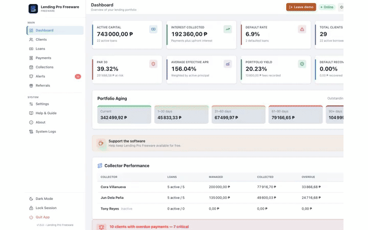
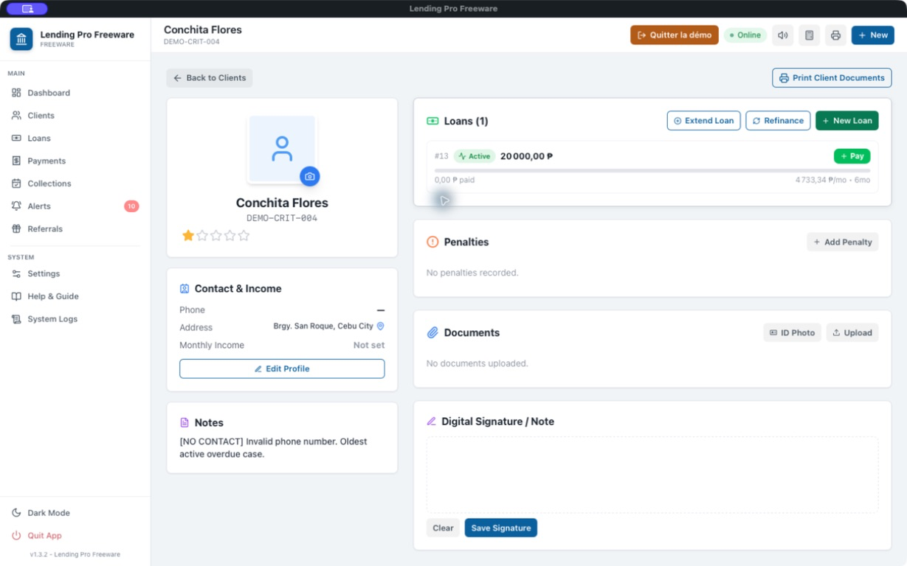
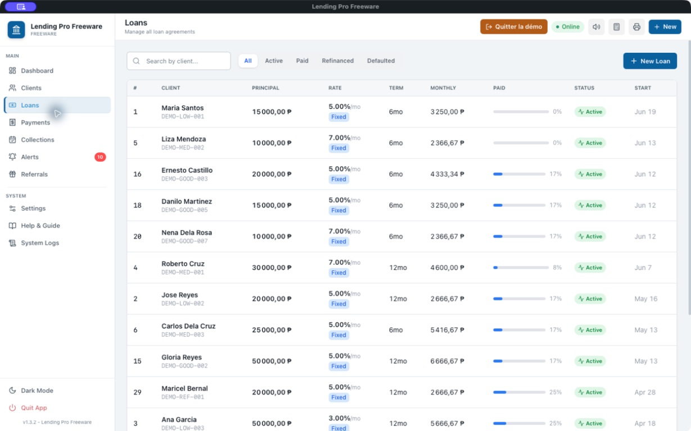
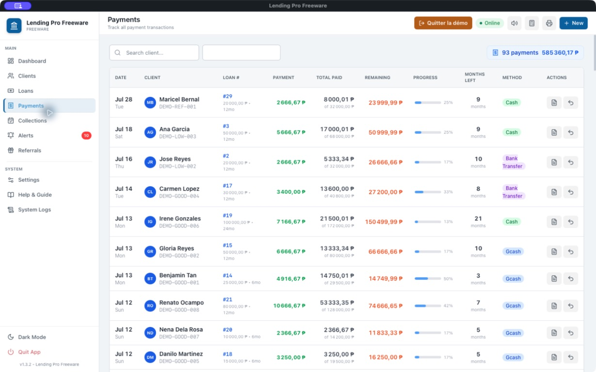
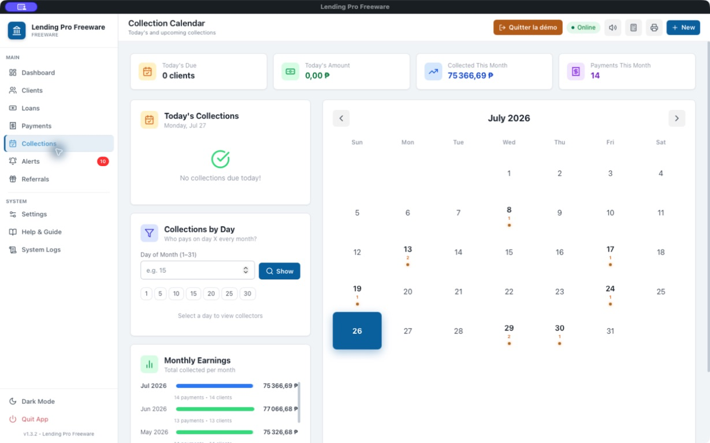
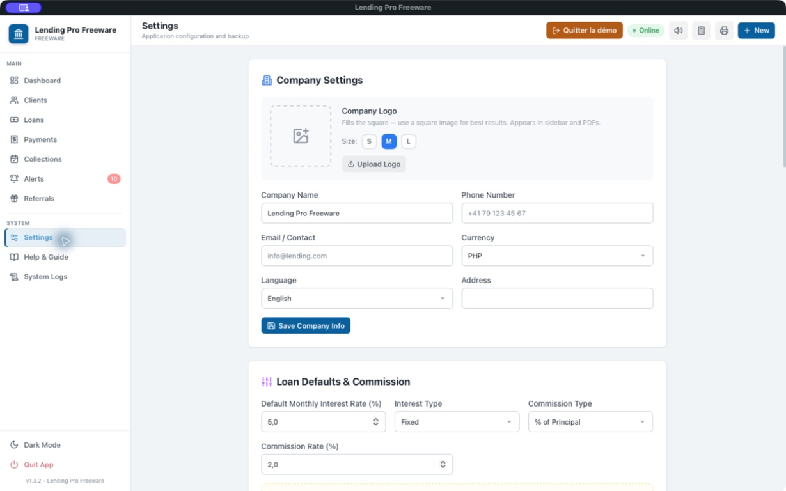

<p align="center">
  
</p>

<h1 align="center">Lending Pro Freeware</h1>

<p align="center">
  A free, private, offline-first desktop app for lenders, moneylenders, cooperatives and microfinance agents to manage clients, loans, repayments, collections, penalties and documents — with no subscription, no cloud lock-in and no telemetry.
</p>

<p align="center">
  <a href="https://github.com/aston76/lending-pro-freeware/releases"></a>
  <a href="LICENSE"></a>
  
  
  
  
  
</p>

---

Lending Pro Freeware is the complete, no-nonsense tool for anyone who lends money and needs a clean, professional ledger. Track every client, loan, payment and overdue balance in one place. Generate signed contracts and receipts as PDF in one click. Capture a borrower's photo and ID live from the webcam. Send collection reminders. Everything stays on your computer — your data never leaves the machine unless you choose to back it up.

It pairs the polish and speed of a modern macOS app with cent-exact accounting and true privacy.

## Why Lending Pro Freeware

- **100% offline and private.** No account, no login, no server, no analytics. Your client book lives on your Mac.
- **Free forever, no catches.** No trial, no paywall, no locked features. A voluntary donation is the only ask.
- **Built for the field.** Webcam capture, signatures, ID documents, SMS reminders and a collection calendar designed for daily rounds.
- **Cent-exact money.** Every schedule is computed with Decimal math, reconciled to its totals, and never drifts on rounding.
- **Truly international.** 22 currencies (USD, EUR, PHP, GBP, CHF, INR and more) and a 17-language interface.
- **Apple-grade UI.** A calm, dense, professional workspace in light or dark theme — no marketing fluff, built to work in.

## Feature tour

| Area | What it does |
| --- | --- |
| **Dashboard** | Live portfolio overview: active capital, interest collected, default rate, total clients, today's collections and recent payments. |
| **Clients** | Full borrower profiles with photo, rating, contact, monthly income, debt-to-income (DTI) ratio, documents and loan history. |
| **Loans** | Fixed-rate and declining-balance schedules, amortization tables, status tracking (active / paid / refinanced / defaulted), extensions and rollovers. |
| **Payments** | Partial payments with smart allocation, voids with audit trail, multiple methods (cash, GCash, bank transfer, check). |
| **Collections** | Monthly calendar of due dates, "who pays on day X" analytics, and monthly earnings trends. |
| **Penalties** | Per-loan penalties with reason, notes and status, rolled into the client balance. |
| **Alerts & SMS** | Automatic overdue detection with severity tiers, one-tap SMS via Twilio or Semaphore, and editable templates. |
| **Commissions** | Track referral commissions between clients and mark them paid. |
| **Documents** | Attach contracts, IDs and files per client; rename or delete; batch-print selected documents. |
| **Exports** | One-click Excel workbooks (full or selective) and professional PDFs: contracts, receipts, amortization schedules. |
| **Backup** | Automatic local backup on every close, manual backups, Google Drive sync, and point-in-time restore. |
| **Profiles** | Multiple isolated profiles (e.g. separate lenders), each optionally protected by a password. |

### Live webcam capture & identity verification

Onboarding a borrower takes seconds. From any client profile you can capture identity material directly from the Mac camera:

- **Profile photo** — a live camera window opens; press Space to capture, Esc to cancel.
- **ID document photo** — same live capture flow, saved as the client's ID.
- **Digital signature** — a touch/mouse signature pad records the borrower's handwritten signature.
- **Document uploads** — attach arbitrary files (contracts, collateral photos, utility bills).

Captures are stored locally per client and appear in their document vault and on generated PDFs. The camera runs in its own process so it never interrupts the app, and nothing is ever uploaded.

<p align="center">
  <a href="docs/screenshots/client-detail.png"></a>
</p>

### Built for any country

Choose from **22 currencies** — USD, EUR, PHP, GBP, CAD, AUD, CHF, JPY, SGD, HKD, AED, SAR, INR, THB, MYR, IDR, VND, KRW, ZAR, MXN, BRL, NZD — with correct zero-decimal handling for JPY, KRW, VND and IDR. The selected currency flows consistently through the UI, SMS, PDF contracts, receipts and Excel exports. The interface is available in **17 languages**, and worldwide address search plus international phone numbers mean it works wherever you lend.

## Screenshots

The animated tour plays at the top of this page. Click any image for full resolution; the complete set is in [docs/SCREENSHOTS.md](docs/SCREENSHOTS.md).

<table>
  <tr>
    <td width="50%" align="center"><a href="docs/screenshots/dashboard-demo.png"></a><br><sub>Dashboard overview</sub></td>
    <td width="50%" align="center"><a href="docs/screenshots/loans.png"></a><br><sub>Loan agreements</sub></td>
  </tr>
  <tr>
    <td width="50%" align="center"><a href="docs/screenshots/payments.png"></a><br><sub>Payment history</sub></td>
    <td width="50%" align="center"><a href="docs/screenshots/collections.png"></a><br><sub>Collection calendar & earnings</sub></td>
  </tr>
  <tr>
    <td width="50%" align="center"><a href="docs/screenshots/client-detail.png"></a><br><sub>Client profile & camera</sub></td>
    <td width="50%" align="center"><a href="docs/screenshots/settings.png"></a><br><sub>Currencies & languages</sub></td>
  </tr>
</table>

## Install on macOS

One command — downloads the latest DMG, validates its SHA-256 checksum, verifies the signature, and installs into `~/Applications`:

```bash
curl -fsSL https://raw.githubusercontent.com/aston76/lending-pro-freeware/main/install.sh | bash
```

Or download the Apple Silicon DMG from [Releases](https://github.com/aston76/lending-pro-freeware/releases), open it, and drag **Lending Pro Freeware** into **Applications**. The app is ad-hoc signed but not Apple-notarized; on first launch Control-click the app, choose **Open**, then confirm.

It starts with an empty personal database. Use **Tester la démo** in the toolbar to load temporary fictitious data; leaving demo mode or restarting returns to your own data.

## Run from source

Requirements: Python 3.11+, Node.js 22+, and the native dependencies required by pywebview.

```bash
python3 -m venv .venv
source .venv/bin/activate
python -m pip install -r requirements.txt -r requirements-dev.txt
npm ci
npm run build:css
python main.py
```

Quality gates:

```bash
npm run check   # Python compile + JS syntax
npm test        # pytest suite
```

The same checks run on every push and pull request via GitHub Actions.

## Privacy and security

- **No telemetry, no analytics, no tracking.** Nothing about you or your clients is ever sent anywhere.
- Client records, settings, photos and signatures stay in the local application data directory.
- Databases, exports, backups, credentials, logs and build artifacts are excluded from Git.
- Map, SMS, Google Drive and donation links use the network only when you actively use that feature.

See [SECURITY.md](SECURITY.md) for responsible vulnerability reporting.

## Who it's for

Independent lenders and moneylenders, microfinance agents, cooperatives, pawnshops, salary-deduction lenders, informal credit groups, and anyone who needs a reliable, private, professional way to track loans and collections — without paying monthly for a cloud SaaS.

## Support the project

Lending Pro Freeware is free forever. If it helps your business, a donation of **€5 or more** on [Ko-fi](https://ko-fi.com/astonswissapp) keeps it maintained. The dashboard keeps a **Don** button; the gentle reminder appears at most weekly, or every 90 days after you confirm a donation, and stays entirely on your device.

## Contributing

Bug reports and focused pull requests are welcome. Read [CONTRIBUTING.md](CONTRIBUTING.md) before submitting a change.

## License

Released under the [MIT License](LICENSE). Copyright © 2026 Aston Swiss App.

<details>
<summary><b>Search keywords</b></summary>

loan management software · moneylender software · lending app · microfinance management · repayment tracker · collection management · amortization schedule · borrower management · offline lending software · macOS loan manager · private lending tool · debt collection app · client ledger · freeware loan software · multi-currency lending · OpenCV webcam capture · digital signature lending · lending pro

</details>
