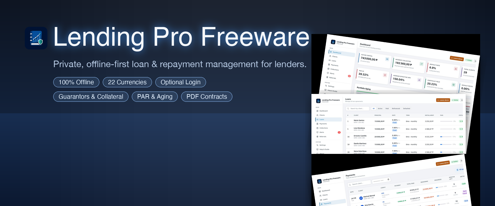
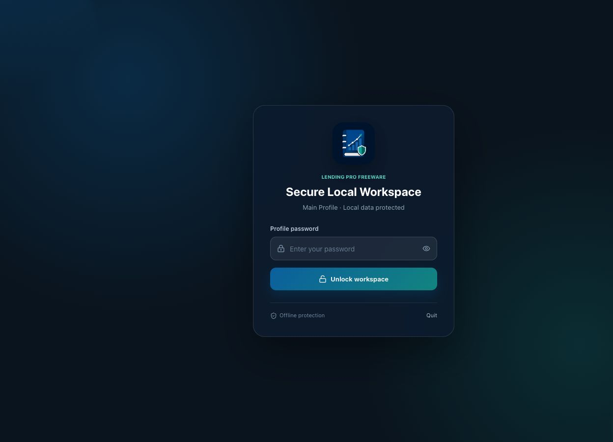

# Lending Pro Freeware — Screenshots

All screenshots were captured from an isolated application profile. The demo data is entirely fictitious and contains no personal information.

## Official banner

The official 1280 x 512 project banner presents Lending Pro as a private loan-management product with repayment tracking, reminders, dashboard analytics, and local data ownership.

## Animated tour

The GitHub-compatible GIF cycles through the dashboard, loan list, payment history, and borrower profile — all captured from Lending Pro 1.5.0 with the new international branding.

## Optional login screen

When login at startup is enabled, the application shows a secure opening screen before loading any business data.

## Dashboard

## Loans & Payments

## Collections

## Client profile — camera, documents & signature

## Settings — profiles, login, currencies & defaults

## Donation reminder

